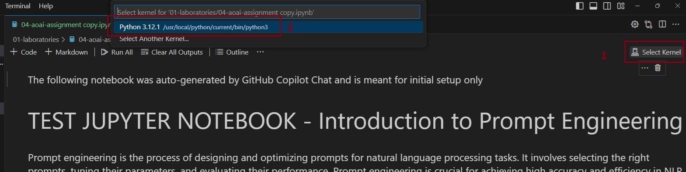
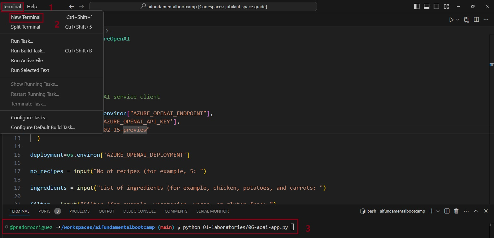
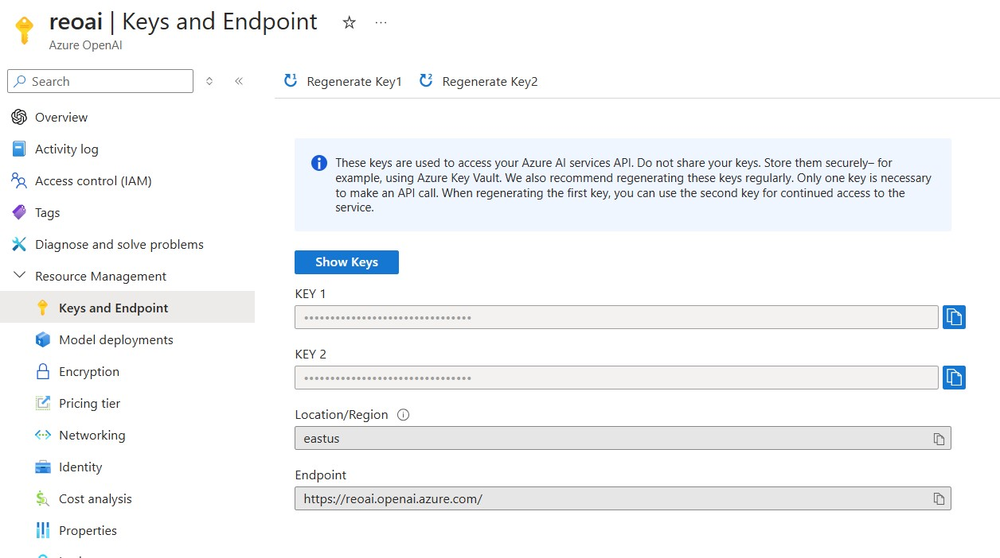
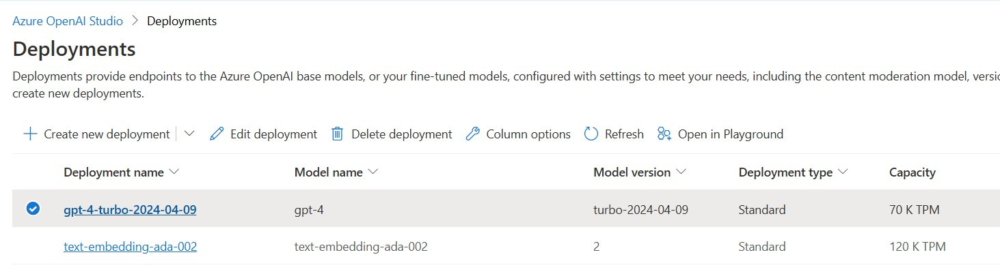
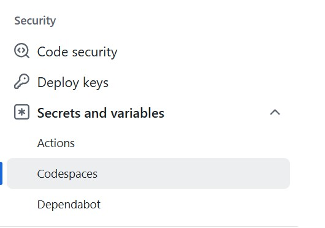
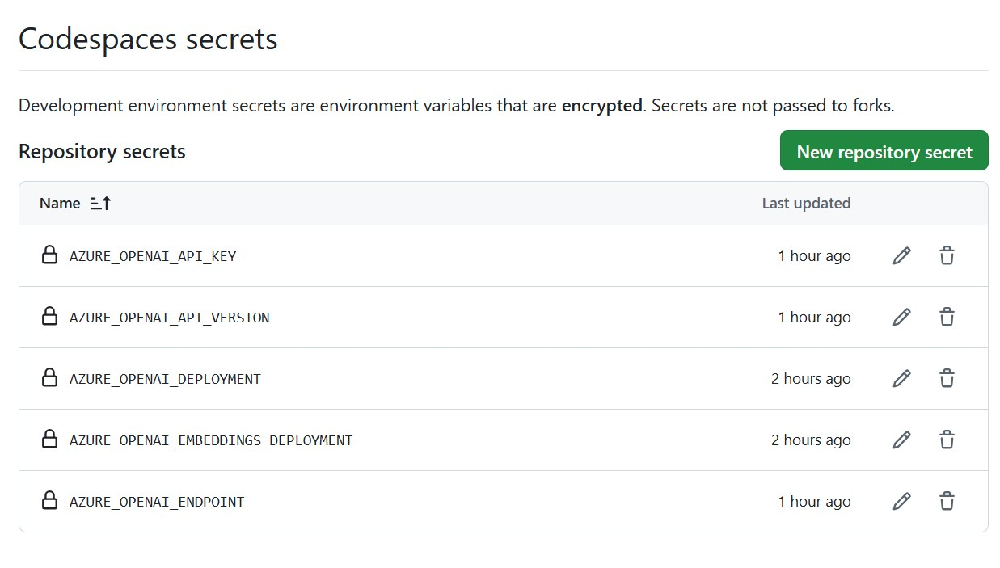

# Setup Your Dev Environment

After setting up the [working environment](./README.md), it is time to configure specific items to make the code work.

## 1. Executing Assignments

This section provides general guidance related to executing those assignments.

### 1.1. Python Assignments

Python assignments are provided either as Jupyter notebooks (`.ipynb` files) or applications (`.py` files).

* **To run the Jupyter Notebook**, open it in Github Codespaces Visual Studio Code, then click **Select Kernel** (at top right) and select the default **Python 3.12.1** option shown. You can now **Run** each action or **Run All** to execute the whole notebook.



* **To run Python applications from command-line**, open a new bash cli by clicking the **Terminal** buttom in the main menu, and execute the code by running `python 01-laboratories/<app_name>.py`.



## 2. Configuring Providers

Assignments **may** also be setup to work against one or more Large Language Model (LLM) deployments through a supported service provider like Azure OpenAI. This provides a **hosted endpoint** (API) that we can access programmatically with the right credentials (API key or token). In this course, we discuss theis provider:

* [Azure OpenAI](https://learn.microsoft.com/azure/ai-services/openai/) for OpenAI models with enterprise readiness in focus.

**You will need to use your own accounts for these exercises**. Some guidance for signup:

| Signup | Cost | API Key | Playground | Comments |
|:---|:---|:---|:---|:---|
| [Azure](https://aka.ms/azure/free)| [Pricing](https://azure.microsoft.com/pricing/details/cognitive-services/openai-service/)| [SDK Quickstart](https://learn.microsoft.com/azure/ai-services/openai/quickstart)| [Studio Quickstart](https://learn.microsoft.com/azure/ai-services/openai/quickstart) | [Apply Ahead For Access](https://learn.microsoft.com/azure/ai-services/openai/) |
| | | | | |

Follow the directions below to **configure** this repository for use with Azure OpenAI:

* `aoai` - requires Azure OpenAI endpoint, key, version and deployment name

Assignments will simply error out on missing credentials.

### 2.1 Environment Variables

You will need to set values for several environment variables for this class to work.  Let's take a quick look at the variable names to understand what they represent:

| Variable  | Description  |
| :--- | :--- |
| AZURE_OPENAI_API_VERSION | This is the Azure OpenAI API version. For this class, we are using '2024-02-15-preview' |
| AZURE_OPENAI_API_KEY | This is the authorization key for using Azure OpenAI |
| AZURE_OPENAI_ENDPOINT | This is the deployed endpoint URL for an Azure OpenAI resource |
| AZURE_OPENAI_DEPLOYMENT | This is the _text generation_ **gpt-4-turbo-2024-04-09** model deployment name.  We recommend that you name your deployment the same.  (see example below) |
| AZURE_OPENAI_EMBEDDINGS_DEPLOYMENT | This is the _text embeddings_ **text-embedding-ada-002** model deployment name We recommend that you name your deployment the same. (see example below)|
| | |

### 2.2 Get Azure OpenAI access values: From Portal

The Azure OpenAI endpoint and key values will be found in the [Azure Portal](https://portal.azure.com) so let's start there.

1. Go to the [Azure Portal](https://portal.azure.com).
1. Go to the Azure OpenAI resource.
1. Expand the **Resource Management** section in the sidebar (menu at left)
1. Click the **Keys and Endpoint** option.
1. Click **Show Keys** - you should see the following: KEY 1, KEY 2 and Endpoint.
1. Use the **KEY 1** value for **AZURE_OPENAI_API_KEY**.
1. Use the **Endpoint** value for **AZURE_OPENAI_ENDPOINT**.



Next, we need to create deployments from the Azure OpenAI models.

1. Click the **Model deployments** option in the sidebar (left menu) for Azure OpenAI resource.
1. In the destination page, click **Manage Deployments**
1. (Optional) You can directly navigate to the [Azure OpenAI Studio website](https://oai.azure.com).

This will take you to the Azure OpenAI Studio website, where we'll find the other values as described below.

### 2.3 Get Azure OpenAI deployments: From Studio

1. Navigate to [Azure OpenAI Studio](https://oai.azure.com) **from your resource** as described above.
1. Click the **Deployments** tab (sidebar, left) to view currently deployed models.
1. If your desired model is not deployed, use **Create new deployment** to deploy it. If using the new portal, use **Deploy model** button.
1. You will need a _text-generation_ model - deploy the following model with the same name: **gpt-4-turbo-2024-04-09**
1. You will need a _text-embedding_ model - deploy the following model with the same name: **text-embedding-ada-002**



# 2.4 Preferred:  Using Codespace secrets

As mentioned, this course requires several environment variables.  After completing the steps above, you should now have all of the variables needed, and you can setup codespace secrets to both use, and protect, these sensitive values.  

1.  In your fork of the main repo, go to the settings button in the top menu bar.

3.  scroll down to Security/"Secrets and Variables"/Codespaces.  You will need to create the secrets below.  Take care to name them exactly as shown, as these will be the names of the env variables inside of the codespaces container once created.


5.  These are the recommended values for the secrets: (do not use quotes, etc.)

| Variable  | Description  |
| :--- | :--- |
| AZURE_OPENAI_API_VERSION | 2024-02-15-preview |
| AZURE_OPENAI_API_KEY | This is the authorization key for using Azure OpenAI (obtained from step 2.2 - sub value) |
| AZURE_OPENAI_ENDPOINT | https://your.openai.azure.com/ (obtained from step 2.2 - sub value) |
| AZURE_OPENAI_DEPLOYMENT | gpt-4-turbo-2024-04-09 |
| AZURE_OPENAI_EMBEDDINGS_DEPLOYMENT | text-embedding-ada-002 |
| | |


# 2.5 Alternative:  Local Computer Setup

If you are running the code locally on your computer, complete the steps below.  **Codespace users can ignore this step.**

### Create `.env` file

We assume that you have already read the guidance above, created the Azure OpenAI service, obtained the required authentication credentials (API_KEY) and have the endpoint URL.

The next step is to configure your **local environment variables** as follows:

1. Inside the online Visual Studio Code **Explorer** section (to the left), look in the root folder for a `.env.copy` file
2. Copy that file to `.env` using the command below. This file is _gitignore-d_, keeping secrets safe.

Open the Codespaces Visual Studio Code **Terminal** cli and execute the following command:

   ```bash
   cp .env.copy .env
   ```

3. Fill in the values (replace placeholders on right side of `=`) as described in the next section.

### Populate `.env` file

Now update the environment variables from the `.env` file to reflect the **Deployment name** used from above. This will typically be the same as the model name unless you changed it explicitly. So, as an example, you might have:

```bash
## Azure OpenAI
AZURE_OPENAI_API_VERSION='2024-02-15-preview' # Default is set!
AZURE_OPENAI_API_KEY='<API-KEY-STRING>'
AZURE_OPENAI_ENDPOINT='https://<endpoint-url>.openai.azure.com/'
AZURE_OPENAI_DEPLOYMENT='gpt-4 turbo-2024-04-09' 
AZURE_OPENAI_EMBEDDINGS_DEPLOYMENT='text-embedding-ada-002'
```

**Don't forget to save the .env file when done BUT NEVER COMMIT THE CHANGES TO YOUR PUBLIC BRANCH!!!**. You can now exit the file and follow your instructor's instructions.

## Let's Get Started

Now that you have completed the needed steps to complete this course, let's get started with the [laboratories](../01-laboratories/README.md).

## Disclaimer

> [!NOTE]
> This project has adopted the [Microsoft Open Source Code of Conduct](https://opensource.microsoft.com/codeofconduct/). For more information read the Code of Conduct FAQ or contact [Email opencode](opencode@microsoft.com) with any additional questions or comments.
